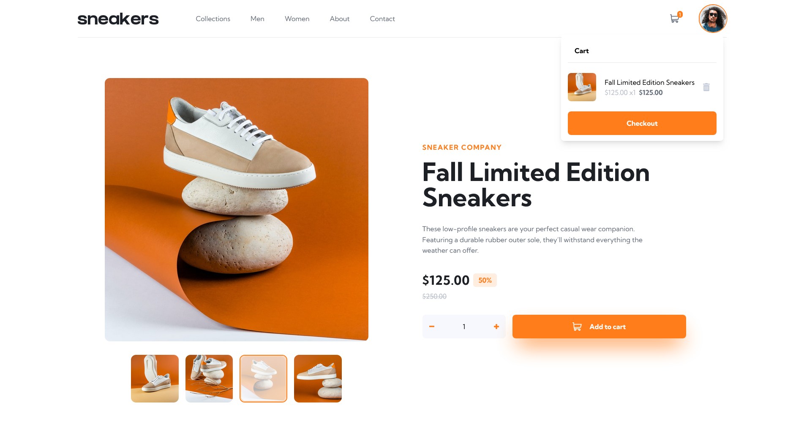

# Frontend Mentor - E-commerce product page solution

This is a solution to the [E-commerce product page challenge on Frontend Mentor](https://www.frontendmentor.io/challenges/ecommerce-product-page-UPsZ9MJp6). Frontend Mentor challenges help you improve your coding skills by building realistic projects.

## Table of contents

- [Overview](#overview)
  - [The challenge](#the-challenge)
  - [Screenshot](#screenshot)
  - [Links](#links)
- [My process](#my-process)
  - [Built with](#built-with)
  - [What I learned](#what-i-learned)
- [Author](#author)

## Overview

I built this project to brush my front end skills and to try out new fun techniques on the go. Loved working on it!

### The challenge

Users should be able to:

- View the optimal layout for the site depending on their device's screen size
- See hover states for all interactive elements on the page
- Open a lightbox gallery by clicking on the large product image
- Switch the large product image by clicking on the small thumbnail images
- Add items to the cart
- View the cart and remove items from it

### Screenshot

### Links

- Solution URL: (https://github.com/Harshita-Naik16/Frontend-Mentor---E-commerce-product-page-solution)
- Live Site URL: (https://frontend-mentor-e-commerce-product-page-solution.vercel.app/)

## My process

- I pondered over what technologies to use for this as this could be made using vanilla.
- But then I made it in a way we could actually scale it to become a full website.
- Went over the tailwind installation and set up all the colors in the tailwind config file.
- The whole setup is what consumes a lot of my time because I cannot work without planning out everything.
- Built the website in desktop size and later worked on responsiveness.

### Built with

- Semantic HTML5 markup
- Flexbox
- CSS Grid
- [React](https://reactjs.org/) - JS library
- TailwindCss - For styles

### What I learned

- some more techniques in tailwind
- working of a lightbox component, as I never built a lightbox before, getting this to work was a bit challenging with respect to design.

## Author

- Website - [Harshita Naik](https://harshita-naik-portfolio.vercel.app/)
- Frontend Mentor - [@Harshita-Naik16](https://www.frontendmentor.io/profile/Harshita-Naik16)
- Github - [Harshita-Naik16 ](https://github.com/Harshita-Naik16)
